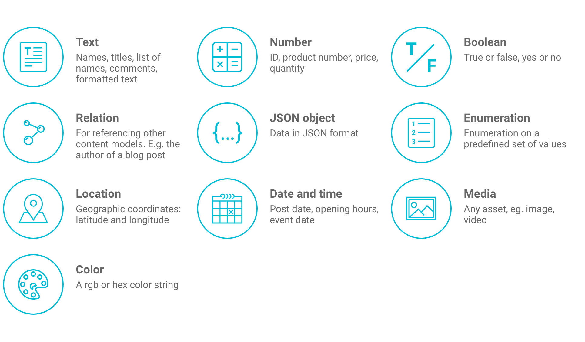

# Concepts

A quick overview on the concepts of GraphCMS.

## Projects

Your content lives within a project. In a project you can:

* Define the shape of your content by adding `content models`
* Add `fields` to your models
* Manage and browse your project´s content
* Upload and assign media files
* Invite others to your team
* Track the activities of your team
* Create `permanent auth tokens` for your applications and content consumers
* Use the integrated GraphiQL playground to run queries and mutations against your project´s endpoint

## Content Models

Content models describe the shape of your content. They consist of several fields while each field can store various types of data (e.g: text, numbers or images). A field can also be a reference to another model, which allows you to build a complex content graph. The fields you associate with a model will also define how its content editing user interface will look like.

## Fields

Fields are the building blocks of your content models. Each field type can store a specific type of data.
GraphCMS offers the following field types:

* **Text:** names, titles, list of names, comments, formatted text, markdown...
* **Number:** ID, product number, price, quantity...
* **Boolean:** true or false, yes or no...
* **Date:** post date, opening hours, date of birth...
* **Enum:** selection on a predefined set of values
* **JSON:** data in JSON format
* **Color:** rgba or hex color string
* **Location:** geographic coordinates: latitude and longitude
* **Media:** any asset, e.g. image, video...
* **Relation:** for referencing other content models. E.g. the author of a blog post

## GraphQL Endpoints

Any GraphCMS project comes with two GraphQL endpoints:

* The `simple endpoint` serves your content with a simple GraphQL schema for use with GraphQL clients like [Apollo](http://dev.apollodata.com/), [Apollo iOS](https://github.com/apollostack/apollo-ios) or [Lokka](https://github.com/kadirahq/lokka)
* The `relay endpoint` serves your content with a relay conform GraphQL schema for [data driven react applications](https://facebook.github.io/relay/)  

## Permanent Auth Tokens

To connect your client applications to your GraphCMS project, you will need to create a `permanent auth token` in your project´s settings. This will allow your client to:

* `CREATE` new content entries
* `READ` existing content entries
* `UPDATE` existing content entries
* `DELETE` existing content entries

!!! warning ""
    Be careful! Anyone that knows one of your tokens will be able to execute all of these operations and manipulate your content. So it is never a good idea to store a token on the client side, i.e. a JavaScript client application.

    We will soon release a feature that will allow you to create `read-only tokens`, so even if someone gains access to such a token, your data will be safe from manipulation.
