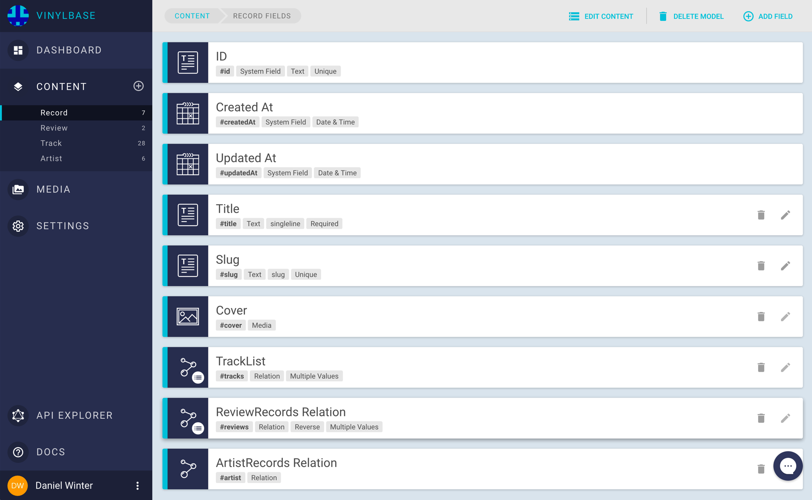
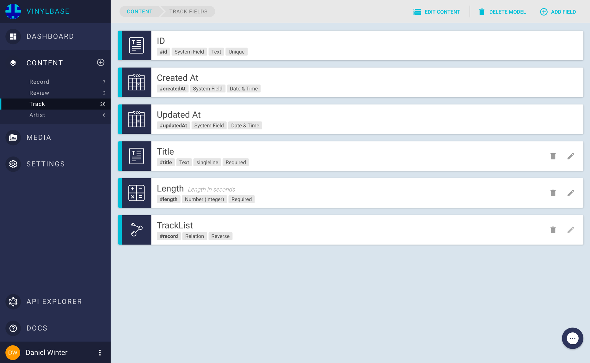
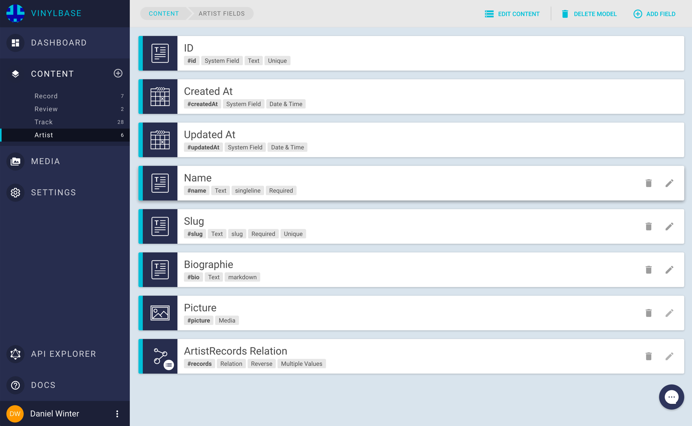

# Example 01: Server-side Rendered App with Next.js and Apollo

🚀 **[Live Demo](https://vinylbase-fsiujaerlv.now.sh/)**

In this example we are going to build a simple server-side rendered Application backed by GraphCMS using [Next.js](https://github.com/zeit/next.js/) and [Apollo](http://www.apollodata.com/). You can find the code in the example´s [GitHub repository](https://github.com/GraphCMS/exmple_01_nextjs_apollo).

The app will be a simple collection of music record reviews. The data model will look as follows:

* Each `Review` belongs to a `Record`
* A `Record` has a list of `Tracks`
* An `Artist` has multiple `Records`

The figure below shows the relations and fields of the four models:


## Setting up the content models in GraphCMS

!!! hint ""
    If you haven´t set up a content model yet, please check our [Getting Started Guide](../Getting_Started). The project from the guide will be the foundation for this example.

To set up the models in GraphCMS, we create a new Project named **Vinylbase** and add our four content models:


Then we add the fields to every content model from the schema above. This should look similar to the screenshots below.
You can see the relevant attributes like type, unique constraints etc. below each field name.






## Authorization

To authenticate the app and to be able to fetch data from GraphCMS, we need to create a [permanent auth token](../Concepts/#permanent-auth-tokens). Per default, all content stored in GraphCMS is private, so you cannot fetch data without a valid token outside the GraphCMS web application.

To create a new auth token, go to the settings view and add a token in the auth tokens section.


Now we can start implementing our frontend application.


## Implementing the app

!!! hint ""
    You can checkout the source code for this project [here](https://github.com/GraphCMS/exmple_01_nextjs_apollo)

For the app we will use [Next.js](https://github.com/zeit/next.js/), which is a minimalistic framework for server-rendered React applications.
Data fetching will be done with [Apollo](http://www.apollodata.com/), a powerful GraphQL client which runs in nearly any environment.
Apollo allows you to query and mutate your data using plain GraphQL queries. This makes the development process easy since you can test your queries in our integrated api explorer and paste them directly into your project. Apollo manages things like caching, prefetching and optimistic UI.

As a starting point we used [this](https://github.com/ads1018/next-apollo-example) project (thanks to [Adam Soffer](http://twitter.com/adamSoffer)).
This projects is a skeleton for using Apollo within a Next.js application. To allow this, it wraps the pages within a higher order component ([HOC](https://facebook.github.io/react/docs/higher-order-components.html)), which will pass down query results from Apollo directly into the component. This is realized by Apollo´s [getDataFromTree](http://dev.apollodata.com/react/server-side-rendering.html#getDataFromTree) function, which checks the React tree on which data it needs to be rendered. This function returns a promise when the data is ready in the Apollo Store, so the page can be rendered.

### Setting up Apollo

First, we need to init the Apollo client to set the API endpoint and set up authorization. This is done within the `createClient` function within `/lib/initClient.js`.
Here we use the middleware feature of the Apollo networkInterface by simply adding our token.

Please check the [docs](http://dev.apollodata.com/react/auth.html) for more information.

```
function createClient (headers) {
  const GRAPHCMS_API = process.env.GRAPHCMS_API
  const TOKEN = process.env.TOKEN

  if (!GRAPHCMS_API || !TOKEN) {
    throw new Error(`Environment variables "GRAPHCMS_API" or "TOKEN" missing`)
  }

  const networkInterface = createNetworkInterface({
    uri: GRAPHCMS_API,

    ops: {
      credentials: 'same-origin'
    }
  })

  networkInterface.use([{
    applyMiddleware (req, next) {
      if (!req.options.headers) {
        req.options.headers = {}
      }

      req.options.headers.authorization = `Bearer ${TOKEN}`
      next()
    }
  }])

  return new ApolloClient({ networkInterface })
}

```

### Getting content into the pages

To use Apollo in our content pages, we need to wrap them with the higher order component `withData` defined in `/lib/withData`. An example can be seen in the `index.js` file from the `pages` folder. This is the entry point of the app and will display a grid of reviews.
To build the query for the required data, we switch over to the **API-Explorer** in GraphCMS and choose "Simple" as endpoint.
Here we can write and test our first query to request all existing reviews:


After we build the query that works for us, we can copy it into the `allReviews` query in the `/pages/index.js` file.
To initialize Apollo queries, we use the `react-apollo` library which wraps and passes the fetched data into the `AllReviews` component. This data will be available as a prop named `data` by default.
To ensure that the Apollo data is available here, we need to wrap the component with the `withData` higher order component as discussed before.

An example is shown below:

```
function AllReviews ({ url: { pathname }, loading, data: { allReviews } }) {
  return (
    <App>
      <Nav pathname={pathname} />
      {
        loading ? <Loading /> : (
          <div>
            <Header
              title='Vinylbase'
              subLine='The best music reviews on the interwebs'
              pageImage='/static/records.svg'
              isIcon
            />
            <section>
              <Grid entries={allReviews} type='reviews' />
            </section>
          </div>
        )
       }
    </App>
  )
}

const allReviews = gql`
  query allReviews {
    allReviews(orderBy: createdAt_DESC) {
      id
      slug
      createdAt
      title
    }
  }`

export default withData(graphql(allReviews)(AllReviews))
```

The rest of the app code is pretty straight forward. For every grid view there is a corresponding page within the root´s `pages` folder, similar to the example above.
For the detail views a `details.js` is placed within a subfolder.
To enable routing to those pages we use the `slug` field of each model. This is a URL safe representation of the unique title or name of the model. This allows us to use pretty and SEO friendly URLs for our pages. GraphCMS allows you to define text fields with the appearance `slug`. This creates a sluggified representation of your text input. To ensure this value is unique, we have marked those fields as `unique` in GraphCMS.
To use these slugs for routing, we must define the corresponding routes in the `server.js` file. We use [Express](https://express.com) as a server, which makes routing easy.

Here is an example of the route to a review´s detail page. It takes the slug from the path and passes it into the component as a prop.

```
server.get('/reviews/:slug', (req, res) => {
  return app.render(req, res, '/reviews/details', { slug: req.params.slug })
})
```


To use this slug in the GraphQL query, we use a $slug variable. Since the slug field is marked as unique in GraphCMS, we can search for it directly by passing it as a parameter to the `Review` query.
To pass the value into the query, we can use the options object in the Apollo wrapper.
This object has an options property, which is a simple function returning the options used by Apollo. The function will receive the props from the router, so we can destructure them to return a variables object, used to set all variables in our query:

```

function Review ({ url: { pathname }, data: { loading, Review } }) {
  return (
    <App>
      <Nav pathname={pathname} />
      {
        loading ? <Loading /> : (
          <div>
            <Header title={Review.title} />
            <ReviewDetails review={Review} />
          </div>
        )
       }
    </App>
  )
}

const reviewDetails = gql`
  query reviewDetails($slug: String! ) {
    Review(slug: $slug) {
      id
      title
      review
      rating
      record {
        title
        cover {
          handle
        }
        artist {
          name
          slug
        }
      }
    }
}`

const ReviewWithData = graphql(reviewDetails, {
  options: ({ url: { query: { slug } } }) => ({ variables: { slug } })
})(Review)

export default(withData(ReviewWithData))
```

All other pages are build in a similar way, so we won't describe all of them here. Feel free to browse the code in the [repository](https://github.com/GraphCMS/exmple_01_nextjs_apollo).
