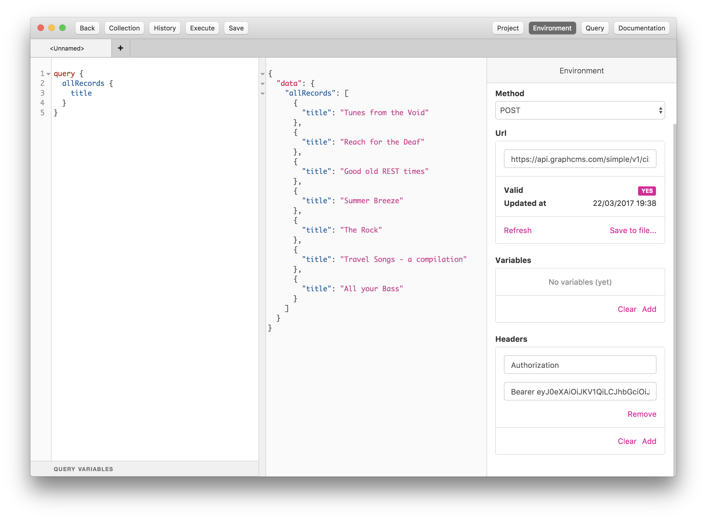

# Using Permanent Auth Tokens

By default, all GraphCMS content APIs are private, so your API is protected from outside access. To access your content from an external client, like a web browser or a native mobile app, you will need to create a `permanent auth token` and assign it to your application. This token needs to be sent with each request to your GraphCMS API.

This will allow your external client to:

* `CREATE` new content entries
* `READ` existing content entries
* `UPDATE` existing content entries
* `DELETE` existing content entries

!!! warning ""
    Be careful! Anyone that gains access to one of your tokens will be able to execute all of these operations and manipulate your content. So it is never a good idea to store a token on the client side, i.e. a JavaScript client application.

    We will soon release a feature that will allow you to create `read-only tokens`, so even if someone gains access to such a token, your data will be safe from manipulation.

!!! hint ""
    As an alternative, you can set up public access for create, read, update and delete operations ([see here](/concepts/#using-permissions)). This will allow you to skip the token step.

You can create auth tokens in your project´s `Settings` view.


After creation, you need to assign the token with each HTTP request to the server. This is done using the `HTTP Authorization Header`:

```
Authorization: Bearer <token>
```

Any request to the server that contains a valid token will be able to create, read, update and even delete data. If the token is invalid, an error will be returned.

## Connecting GraphQL IDE to your Backend

The [GraphQL IDE](https://github.com/redound/graphql-ide) is a handy tool for GraphQL development. To quickly demonstrate how to authenticate with an auth token, we create a new project in the IDE.

First you need to enter your GraphCMS project´s endpoint URL, which you can find in your project´s `Settings` view.

After this, you just need to add the `HTTP Authorization Header` with `Bearer <token>` as header value (see screenshot below).



## Using curl to query your Backend

The easiest way to query your API is [curl](https://curl.haxx.se/). With curl you can send queries or mutations to your API from the command line.

To authorize your request using a `permanent auth token` from GraphCMS you simply have to pass it as a header along with your request.

```bash
curl -H "Authorization: bearer <token>" -H 'content-type: application/json' -X POST -d '
{
 "query": "query {
    allRecords {
      title
    }
  }"
}
' https://api.graphcms.com/simple/v1/ciz189ut5j9wl0185r42lvfzp
```

## Using Lokka to query your Backend

[Lokka](https://github.com/kadirahq/lokka) is a Simple GraphQL client for JavaScript which works on all the JavaScript environments including Browser, NodeJS and React Native.

To authorize your requests using a `permanent auth token` you have to pass it as a header
```js
const Lokka = require('lokka').Lokka;
const Transport = require('lokka-transport-http').Transport;

const headers = {
  'Authorization': `Bearer ${<token>}`
};

const client = new Lokka({
  transport: new Transport('https://api.graphcms.com/simple/v1/ciz189ut5j9wl0185r42lvfzp', { headers })
});

client.query(`
  {
    allRecords {
      title
    }
  }
`).then(result => {
    console.log(result.allRecords);
});
```

## Using Apollo to query your Backend

[Apollo](http://dev.apollodata.com/) is a flexible, fully-featured GraphQL client which can be used on every platform.

To authorize your requests using a `permanent auth token` you have to register a middleware, which adds the token to all outgoing requests. The example below shows how to do this with `react-apollo`, but you can use it for other Apollo implementations as well.

```js
import { ApolloClient, createNetworkInterface } from 'react-apollo';
const networkInterface = createNetworkInterface({
  uri: 'https://api.graphcms.com/simple/v1/ciz189ut5j9wl0185r42lvfzp',
});

networkInterface.use([{
  applyMiddleware(req, next) {
    if (!req.options.headers) {
      req.options.headers = {};  // Create the header object if needed.
    }
    req.options.headers.authorization = `Bearer ${<token>}`;
    next();
  }
}]);
const client = new ApolloClient({
  networkInterface,
});
```
